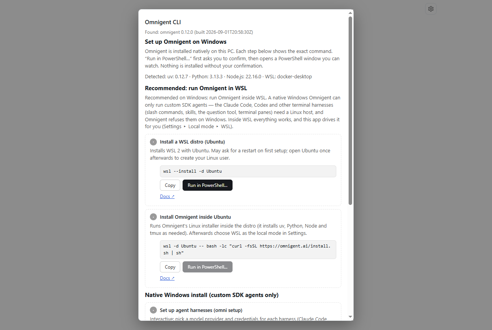
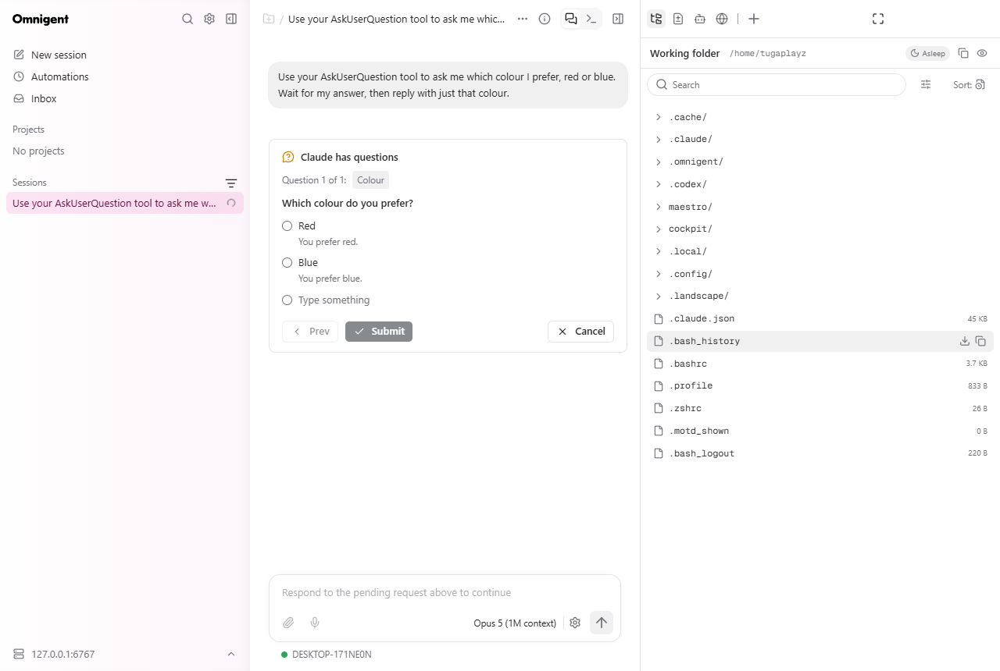
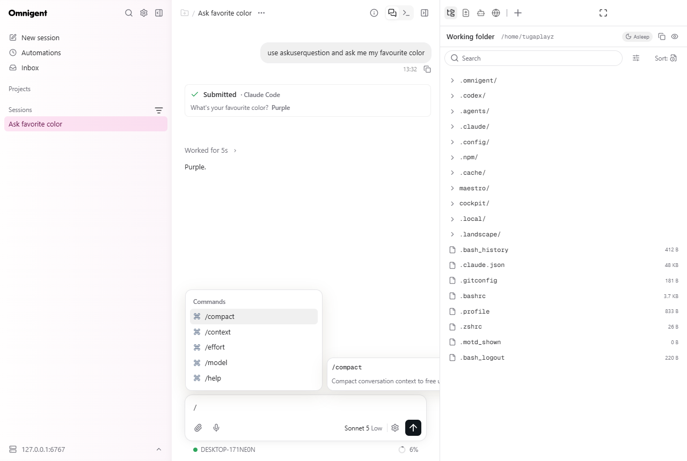
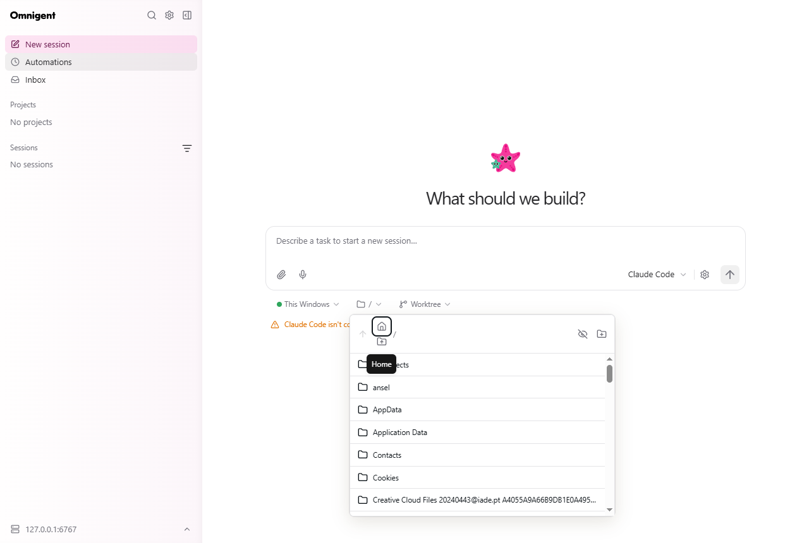
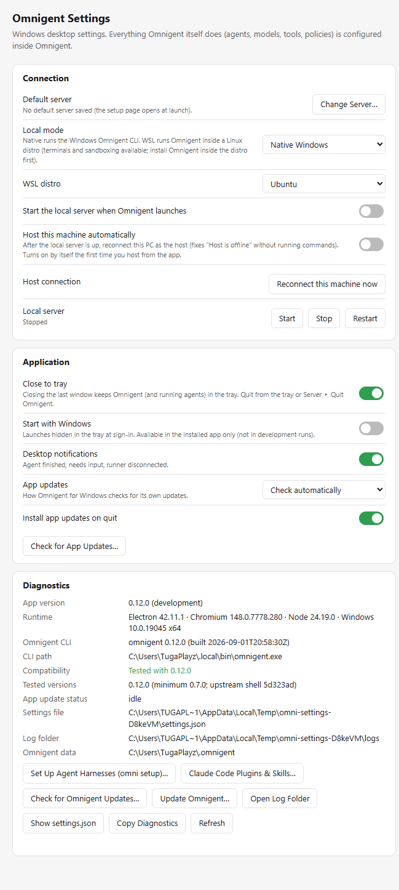

# Omnigent for Windows

[](https://github.com/leobbaroni/Omnigent-windows/actions/workflows/build-windows.yml)
[](https://github.com/leobbaroni/Omnigent-windows/releases/latest)


A first-class Windows desktop app for [Omnigent](https://omnigent.ai): the same
web UI Omnigent serves, in a seamless native window, plus everything a browser
can't do on Windows:

- **One-click setup** when Omnigent isn't installed: the app detects what's
  missing and offers each install step as a button (exact command shown,
  confirmed, run in a visible PowerShell; never silent).
- **Local server you can start, stop and restart from the tray**, natively or
  **inside WSL** (recommended: that's where Claude Code / Codex sessions, slash
  commands, skills, plugins and terminal panes work).
- **Automatic host reconnect**: once you've hosted from this PC, every launch
  brings the server up and re-enrols the machine — no more "Host is offline".
- Native folder picker, tray, close-to-tray, taskbar badge, Windows toasts,
  start with Windows, deep links, multiple windows and servers, in-app updates
  for both the app and Omnigent, structured logs, a Windows settings window.

It is a Windows-hardened build of Omnigent's own Electron desktop shell — not a
rewrite. Omnigent stays the source of truth for everything agent-related.
Details: [`ARCHITECTURE.md`](ARCHITECTURE.md), [`COMPAT.md`](COMPAT.md)
(audit + capability matrix), [`PARITY.md`](PARITY.md) (what was verified).

<p align="center">
  
  
</p>

## Quick start (3 steps)

1. **Download** the latest [`Omnigent-Setup-<version>.exe`](https://github.com/leobbaroni/Omnigent-windows/releases/latest)
   (or the portable exe) and run it. Builds are unsigned for now, so
   SmartScreen asks once: *More info → Run anyway*.
2. **Click ⚙ on the Connect page.** The setup panel shows what it detected and
   one button per remaining step (uv, Omnigent, WSL, Claude Code sign-in).
   Each button confirms the exact command and runs it in a PowerShell window.
3. **Click Start locally.** The UI opens; the tray icon takes over lifecycle
   (start/stop/restart/reconnect/quit).

Prefer a script? The same steps, still confirming each one:

```powershell
irm https://raw.githubusercontent.com/leobbaroni/Omnigent-windows/main/scripts/setup.ps1 | iex
```

## Native Windows vs WSL

| | Native Windows Omnigent | Omnigent in WSL (recommended) |
|---|---|---|
| Server, web UI, sessions, automations, inbox | ✅ | ✅ |
| Custom SDK agents (`claude-sdk`, `codex`, `cursor`, `copilot`) | ✅ | ✅ |
| Claude Code / Codex sessions: slash commands, skills, plugins, question tool | ❌ Omnigent refuses terminal harnesses on Windows | ✅ verified |
| Terminal panes, sandboxing | ❌ | ✅ |

The setup panel says the same thing and walks you into WSL:
`wsl --install -d Ubuntu` → *Install Omnigent inside Ubuntu* → *Sign in to Claude
Code inside Ubuntu* → **Settings ▸ Local mode ▸ WSL**. Everything after that is
transparent: `Start locally` runs `wsl -d Ubuntu --shell-type login -- omnigent
server --background` and the host is enrolled inside the distro.

<p align="center">
  
  
</p>

## Slash commands, skills, plugins, connectors

- **In a session**, type `/` in the composer: Omnigent lists its built-ins
  (`/compact`, `/context`, `/effort`, `/model`, `/help`) and the session's
  **Skills**. Claude Code plugin skills appear namespaced (for example
  `/cockpit:pilot`); the bare form (`/pilot …`) is also understood, because
  Omnigent passes `/` commands straight to Claude Code, which renders the
  result as a card.
- **On the New session landing box** Omnigent hides the menu on purpose for
  Claude Code / Codex (those CLIs own their commands). Start the session, then
  use `/`.
- **Manage from the tray**: *Manage ▸ Claude Code Plugins & Skills…* opens
  Claude Code in your backend (`/plugin`, `/skills`), *Manage ▸ New Session*
  opens the composer where agents, skills and MCP connectors are configured
  per session, and *Manage ▸ Omnigent Settings / Sandbox Integrations /
  Policies* open Omnigent's own settings pages in the window.

## Tray

Open · New Window · status line · **Start / Stop / Restart local server** ·
Change Server · **Reconnect This Machine as Host** · Manage ▸ (sessions,
automations, inbox, Omnigent settings, Claude Code plugins, `omni setup`) ·
Check for App / Omnigent updates · Settings · Open Log Folder · Quit.

Closing the last window hides the app in the tray (agents keep running); **Quit**
is explicit (tray, or Server ▸ Quit Omnigent, Ctrl+Q).

## Windows Settings (Server ▸ Windows Settings…, Ctrl+,)



Connection: default server, **local mode (native / WSL)**, distro, **start the
local server at launch**, **host this machine automatically**, reconnect now,
Start/Stop/Restart. Application: close to tray, start with Windows,
notifications, app-update mode. Diagnostics: versions, CLI, compatibility,
server, paths, Copy Diagnostics, `omni setup`, Claude Code plugins, update
Omnigent.

## Local server and host

- **Start locally** runs `omnigent server --background` (native or through
  WSL), streams the boot log and opens the UI. A server that's already running
  is attached, never duplicated; the app only stops servers it started.
- **Host**: the first time you host from the app (or press *Reconnect This
  Machine as Host*), it remembers that. From then on every launch reconnects
  the host automatically; you can still connect the window to another server
  or switch hosts inside Omnigent at any time.
- If a server the app started stops responding, a toast offers Restart.

## Remote servers, multiple windows

Enter any server URL on the Connect page. Sign-in flows (OIDC, Databricks,
GitHub, Google, Slack, Atlassian, Microsoft) open as hardened popups inside the
app. *Server ▸ New Window* (same server) and *Server ▸ New Window on Different
Server…* give side-by-side sessions; notifications are prefixed by server and
the badge sums unread sessions. `omnigent://host/c/<session>` links open the
right window.

## Notifications and badge

Toasts when an agent finishes, needs input, or a runner disconnects (never for
the session you're viewing). Click → focus/unhide + open the session. The
taskbar shows an overlay badge with the unread count; the frame flashes when
unfocused. Toggle in Windows Settings.

## Updates

- **App**: Server ▸ Check for Updates… (GitHub Releases feed; explicit download
  and install; modes automatic / at launch / manual / never).
- **Omnigent**: tray ▸ Check for Omnigent Updates… (`omni upgrade --check`) and
  Update Omnigent… (confirms, then runs `omni upgrade` visibly).
- Compatibility: tested versions are recorded (`COMPAT.md` §15); an untested
  version shows a one-time notice, nothing is disabled.

## Troubleshooting

| Symptom | What to do |
|---|---|
| "Host is offline" | Tray ▸ *Reconnect This Machine as Host* (or turn on *Host this machine automatically* in Windows Settings). |
| "CLI not found" but it's installed | Click Re-detect. Native: `%USERPROFILE%\.local\bin\omnigent.exe`; WSL: Settings ▸ Local mode ▸ WSL + distro. |
| Session fails with "Native terminal harnesses are not supported on Windows" | You're on a native Windows host with Claude Code/Codex. Switch to WSL (Settings) or pick a custom SDK agent. |
| Claude Code says it isn't configured in the distro | Setup panel ▸ *Sign in to Claude Code inside Ubuntu* (or `wsl -d Ubuntu --shell-type login -- claude`). |
| Start locally fails | Boot log on the Connect page; `~/.omnigent/logs/server/` (Windows or inside the distro). |
| No toasts | Windows Settings ▸ notifications; check Focus assist. |
| SmartScreen warning | Unsigned build; *More info → Run anyway*. |
| Logs | `%APPDATA%\Omnigent\logs\omnigent-desktop.log` (rotating, secrets redacted); tray ▸ Open Log Folder. |

## Development

```bash
corepack enable                 # pnpm 11 via corepack
cd app && pnpm install          # downloads Electron
pnpm test                       # node --test (492 tests)
pnpm start                      # electron .
```

Useful scripts (repo root): `scripts/dev-screenshot.mjs`, `dev-tray-check.mjs`,
`dev-settings-shot.mjs`, `dev-spa-check.mjs`, `dev-session-check.mjs`
(real session incl. AskUserQuestion), `dev-session-slash.mjs`,
`dev-packaged-smoke.mjs`, `dev-portable-probe.mjs`. Real-install e2e:
`node --test app/e2e/win_smoke.e2e.js` (skips without Omnigent).

Layout: `app/` = vendored upstream shell + Windows code in `app/src/win/`
(hooks marked `// [win]`); `upstream.lock.json` pins the upstream commit;
`scripts/sync-upstream.mjs` re-vendors it (see `app/UPSTREAM.md`).

## Build

```bash
cd app
pnpm run build:win        # NSIS installer + portable exe + latest.yml in app/dist/
pnpm run build:win:dir    # unpacked app only
```

electron-builder needs a `pnpm` binary on PATH (not just `corepack pnpm`):

```powershell
corepack enable --install-directory "$env:LOCALAPPDATA\corepack-shims"
$env:PATH = "$env:LOCALAPPDATA\corepack-shims;$env:PATH"
```

## Release

1. Bump `app/package.json` `version`; update `COMPAT.md` §15.
2. Commit, tag `v<version>`, push the tag: `release.yml` builds, tests and
   publishes installer + portable + `latest.yml` to a GitHub Release, which is
   what installed apps update from.
3. Code signing: add `CSC_LINK` / `CSC_KEY_PASSWORD` secrets; no workflow change.

## Manual test checklist

1. Fresh machine: Connect page, ⚙ dot, setup panel detections; Run buttons show the confirm dialog; Cancel runs nothing.
2. Start locally (native and WSL): boot log, UI loads, tray status running.
3. Existing server is attached; Quit leaves it running; owned server is stopped.
4. Stop/Restart from tray and Settings; kill the owned server → toast offers Restart.
5. Host: Reconnect from tray; relaunch with *Host automatically* on → host online without commands.
6. Session on WSL host: AskUserQuestion card, `/` menu with Skills, `/cockpit:pilot`.
7. Notifications + badge for a background session; click focuses and navigates.
8. Close-to-tray, balloon once, tray click restores, Quit exits.
9. New Window / New Window on Different Server; deep link `omnigent://…`.
10. OAuth popup (MCP connector sign-in), file drag-drop, external links.
11. App update check, Omnigent update check, `omni setup`.
12. Installer: install, launch from Start menu, uninstall (settings kept).
